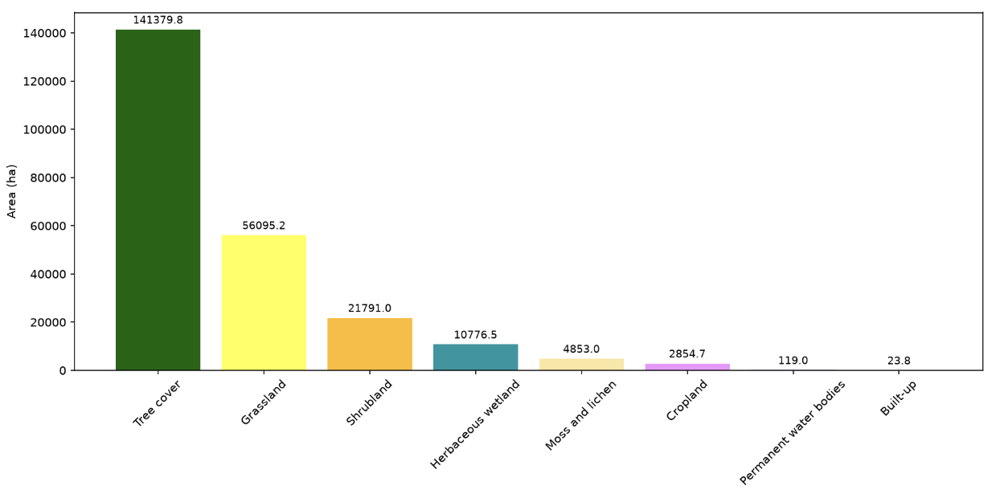
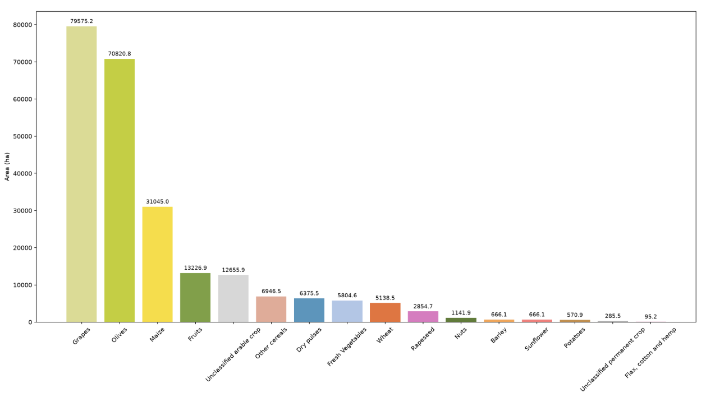
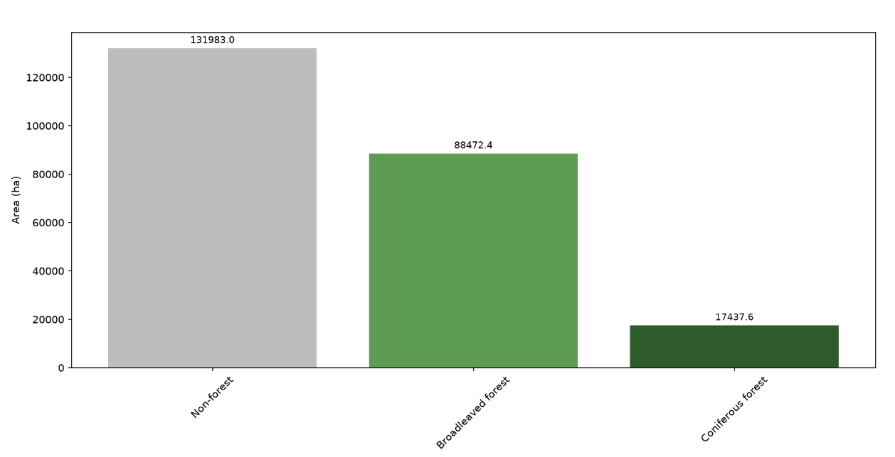
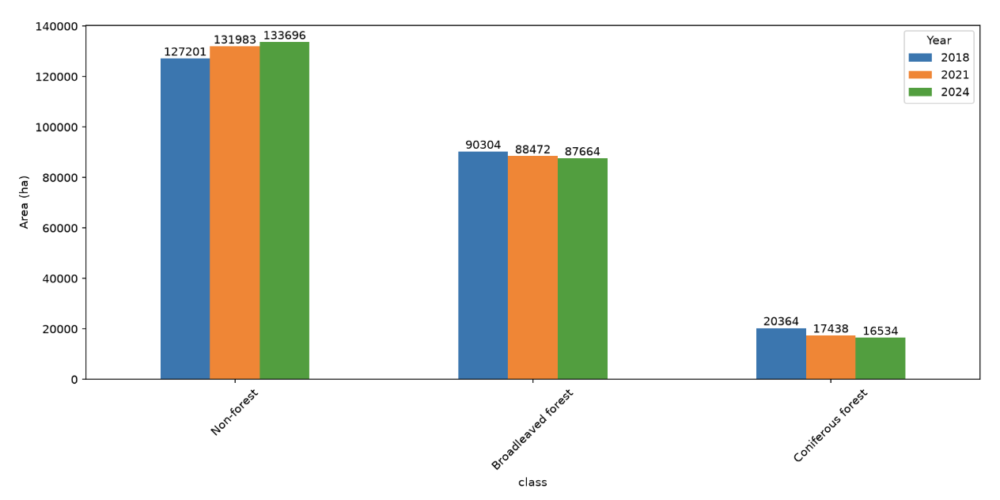

# clms-aoi

A lightweight Python library and CLI for extracting and summarising Copernicus Land Monitoring Service (CLMS) data for any area of interest, via Sentinel Hub's Statistical API.

Point it at a boundary file, pick a product and year, and get back a pandas DataFrame, a CSV, and/or a bar chart — no hand-rolled Sentinel Hub request boilerplate required.

> **Status:** early (`0.1.3`). The Python API is the primary interface today; the CLI currently covers config/auth/AOI validation only (see [CLI usage](#cli-usage)).

---

## Who is this for?

Land use analysts, GIS practitioners, students, NGOs, and small consultancies who want quick AOI-level summaries without setting up a full geospatial processing pipeline.

---

## Supported products

| Product | Description | Available years | Status |
|---|---|---|---|
| Dynamic Land Cover | Annual global land cover classification (tree cover, cropland, grassland, built-up, water, etc.) | 2020 | Available via Python API (`LandCover`) |
| Forest Type (FTY) | Broadleaved vs. coniferous forest classification | 2018, 2021, 2024 | Available via Python API (`ForestType`) |
| Crop Type (CTY) | Per-pixel crop classification (wheat, maize, vineyards, olives, etc.) | 2018, 2021, 2024 | Available via Python API (`CropType`) |

---

## Installation
For users:
```bash
pip install clms-aoi
```
For devs:
1. Clone the repository
2. Change directory into the cloned folder
```bash
cd clms-aoi
```
3. Create a virtual environment and activate it
```bash
python3 -m venv clms_aoi_env && source clms_aoi_env/bin/activate
```
4. Do an editable install which means edits to the source code keep working without reinstalling
```bash
pip install -e .
```
5. To run tests for this project
```
pip install pytest
```
and run:
```
pytest
```
---

## Configuration

Create a YAML config file with your Sentinel Hub credentials (get these from the [Copernicus Data Space Ecosystem](https://shapps.dataspace.copernicus.eu/dashboard)):

```yaml
sentinelhub:
  client_id: "your-client-id"
  client_secret: "your-client-secret"
```

Credentials can also be supplied via the `CLMS_SH_CLIENT_ID` / `CLMS_SH_CLIENT_SECRET` environment variables instead of (or as a fallback for) the YAML file.

**Never commit a config file containing real credentials.** Keep your local config out of version control (it's covered by `.gitignore` by default) — a config file with a placeholder/example only should be committed, if any.

---

## CLI usage

The CLI currently covers configuration and AOI validation. Product analysis (land cover, forest type, etc.) is available through the [Python API](#python-api) below.

```bash
# Validate a config file's structure
clms-aoi validate-config config/config.yaml

# Check Sentinel Hub credentials are valid
clms-aoi check-auth --config config/config.yaml

# Validate an AOI boundary file (.geojson or .gpkg)
clms-aoi check-aoi --aoi tests/data/test_aoi.geojson
clms-aoi check-aoi --aoi tests/data/test_aoi.gpkg

# Run with verbose (debug) logging
clms-aoi -v check-aoi --aoi tests/data/test_aoi.geojson

# Errors are reported cleanly instead of raising a traceback
clms-aoi check-aoi --aoi missing.geojson
```

### Options

| Option | Description |
|---|---|
| `--verbose`, `-v` | Enable debug logging output. Global flag, placed before the subcommand. |
| `--aoi` | Path to a GeoJSON or GeoPackage file (`check-aoi`). Multi-feature inputs are merged into a single geometry. |
| `--config` | Path to the YAML config file (`check-auth`). Defaults to `config.yaml` in the current directory. |

---

## Python API

You can call the library directly from notebooks or pipelines:

```python
from clms_aoi import LandCover, ForestType

lc = LandCover(config_path="config.yaml")

# Single year
result = lc.analyse(aoi="boundary.geojson", year=2020)

# Multiple years
result = lc.analyse(aoi="boundary.geojson", years=[2018, 2021, 2024])

result.to_csv("landcover.csv")
result.to_chart("landcover.jpg")

# Access the underlying DataFrame directly
result.data

# Fetch and display the color-mapped map for a single year
lc.visualize(aoi="boundary.geojson", year=2020)
```

`ForestType` and `CropType` have the same shape:

```python
from clms_aoi import ForestType, CropType

ft = ForestType(config_path="config.yaml")
result = ft.analyse(aoi="boundary.geojson", years=[2018, 2021, 2024])
result.to_csv("forest_type.csv").to_chart("forest_type.jpg")

ct = CropType(config_path="config.yaml")
result = ct.analyse(aoi="boundary.geojson", years=[2018, 2021, 2024])
result.to_csv("crop_type.csv").to_chart("crop_type.jpg")
```

Pass exactly one of `year=` (a single int) or `years=` (a list/range of ints) to `analyse()`.

---

## Outputs

### CSV / DataFrame

`result.data` is a tidy `pandas.DataFrame` with columns for class name, pixel count, percentage of the AOI, and area in hectares. When multiple years are requested, a `year` column is added and all years are included in a single table. `result.to_csv(path)` writes that table to the path you give it.

### Chart (JPG)

`result.to_chart(path)` renders a bar chart of area per class. When multiple years are requested, the chart groups bars by class with one bar per year so trends are visible at a glance.

---

## Example results

Charts below were generated with `to_chart()` for a test AOI. Drop the corresponding image files into `docs/images/` (same filenames as referenced here) to have them render.

**Figure 1.** Dynamic Land Cover class distribution for the test AOI, 2020. Each class is drawn in its conventional colour, sorted by area, with values labelled in hectares.



**Figure 2.** Crop Type class distribution for the test AOI, 2021, showing the per-class cultivated area in hectares.



**Figure 3.** Forest Type class distribution for the test AOI, 2021 (broadleaved, coniferous, and non-forest).



**Figure 4.** Multi-year Forest Type comparison for the test AOI (2018, 2021, 2024), with one bar per year within each class to show change over time.



---

## Dependencies

- `sentinelhub` — authenticated Statistical API requests
- `geopandas`, `shapely`, `pyproj` — AOI handling and reprojection
- `numpy` — raster array summarisation
- `matplotlib` — chart and map rendering
- `pandas` — tabular output
- `requests` — Sentinel Hub OAuth token requests
- `PyYAML` — config parsing

---

## Limitations and known constraints

- **Only three CLMS products are fully wired up.** Dynamic Land Cover, Forest Type, and Crop Type are exposed as `LandCover`/`ForestType`/`CropType`.
- **No change detection.** The library reports values per year but does not compute transition matrices or gain/loss statistics between years yet.
- **No map outputs to disk.** `visualize()` returns/plots an image array; it does not currently save clipped raster maps to a file for you.
- **AOI size.** Sentinel Hub has request size and pixel count limits; very large AOIs may hit them.

---

## Quick start

Install the package and add your Sentinel Hub credentials to a config file, then run:

```python
from clms_aoi import LandCover

lc = LandCover(config_path="config.yaml")
result = lc.analyse(aoi="./my-boundary.geojson", year=2022)

result.to_csv("./results/land-cover-2022.csv")
result.to_chart("./results/land-cover-2022.jpg")
```

You'll find a CSV table and a bar chart in `./results/`, ready to share.


## AI Use Disclaimer 

AI tools were used to help scaffold the Python library, setting up the boilerplate, so it works both as a CLI and as an importable Python package, and to help work out an approach for extracting pixel values from the requested products. All generated outputs were reviewed and adjusted by hand to match the specific requirements of clms-aoi. 


---

## Authors

- **Victor Ademoyero** — [victor.ademoyer@stud.plus.ac.at](mailto:victor.ademoyer@stud.plus.ac.at)
- **Julia Wakaba** — [julia.wakaba@stud.plus.ac.at](mailto:julia.wakaba@stud.plus.ac.at)
- **Riya Pokhrel** — [riya.pokhrel@stud.plus.ac.at](mailto:riya.pokhrel@stud.plus.ac.at)

## Instructor

**Martin Sudmanns** — [martin.sudmanns@plus.ac.at](mailto:martin.sudmanns@plus.ac.at)

## License

This project was created for the Practice Software Development (651.051) final project submission.
